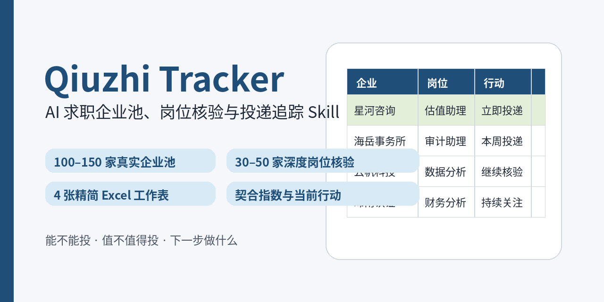
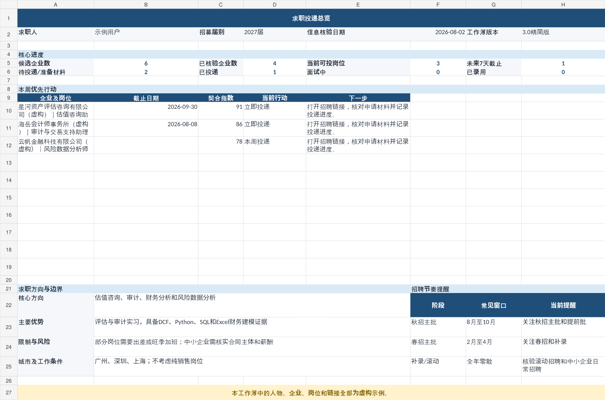
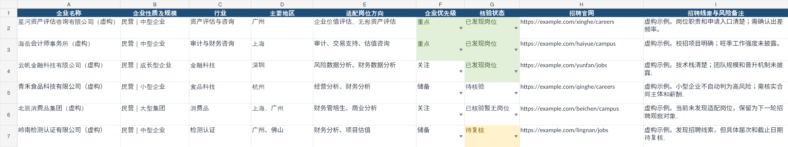
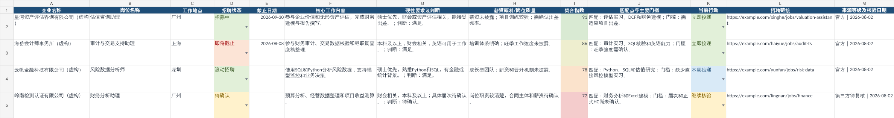

# Qiuzhi Tracker


> Maintainer: [XiaoK00](https://github.com/XiaoK00)
<p align="center">
  
</p>

一个面向 **Codex Agent Skills** 的求职信息整理工具。它会根据简历与求职限制，建立真实候选企业池，深度核验具体招聘岗位，计算岗位契合指数，并生成少列、可行动、便于持续更新的 Excel 求职追踪表。

> 它不追求堆积字段，而是帮助求职者判断：现在能不能投、是否值得投、下一步做什么。

## 为什么做这个 Skill

普通求职表常见两个问题：

- 公司名单很多，但不知道哪些岗位真实、是否仍在招聘。
- 字段越来越多，企业信息、岗位信息和投递过程反复重复，最后难以维护。

Qiuzhi Tracker 将研究底稿和用户工作表分开。联网检索数据可以很详细，但最终 Excel 只保留会改变投递决定和下一步行动的信息。

## 核心能力

- 默认建立 100–150 家不重复的真实候选企业池
- 保留大型企业、中型企业、小型企业和初创企业，并明确招聘线索与风险
- 深度核验 30–50 家高匹配企业的具体岗位
- 区分官方、官方关联渠道和第三方待复核来源
- 按简历证据计算 0–100 的岗位契合指数
- 将优先级统一为明确的当前行动
- 生成四张精简工作表
- 运行验证脚本，检查重复、日期、来源和状态冲突
- 增量更新时保护投递日期、联系人、面试记录和复盘等人工字段

## 最终工作簿

| 工作表 | 作用 | 可见列数 |
|---|---|---:|
| 求职总览 | 核心进度、本周行动、求职方向与招聘节奏 | 面板式 |
| 企业池 | 管理值得长期关注的公司，一家公司一行 | 9 |
| 岗位清单 | 管理具体招聘机会，同一企业可有多行 | 13 + 1个窄技术列 |
| 投递进度 | 只记录准备投递或已经投递的岗位 | 9 + 1个窄技术列 |

### 求职总览



### 企业池



### 岗位清单



截图和示例工作簿使用的全部是虚构数据。

## 安装

### 方法一：在 Codex 中从 GitHub 安装

在 Codex 中调用 `$skill-installer`：

```text
$skill-installer install https://github.com/XiaoK00/qiuzhi-tracker/tree/main/skills/qiuzhi-tracker
```

安装完成后重启 Codex，使新 Skill 被发现。

### 方法二：下载 Release

进入仓库右侧的 **Releases**，下载：

```text
qiuzhi-tracker-v1.0.0.skill
```

只有在你的客户端支持导入 `.skill` 文件时才使用这种方式。Codex 用户优先使用 GitHub 目录安装。

### 方法三：手动复制

将以下文件夹复制到 Codex 的 Skills 目录：

```text
skills/qiuzhi-tracker
```

默认目标目录通常是：

```text
~/.codex/skills/qiuzhi-tracker
```

## 使用示例

### 完整创建

```text
请使用 qiuzhi-tracker Skill。

读取我的简历和求职限制，建立100至150家真实候选企业池，
深度核验30至50家高匹配企业的当前届次岗位，
逐条计算契合指数和当前行动，并生成完整Excel求职追踪表。

不要使用示例企业，不要只搭建空白模板。
```

### 更新旧表

```text
请使用 qiuzhi-tracker Skill 更新这份求职追踪表。

保留我的投递日期、简历版本、联系人、面试记录和复盘，
重新核验岗位状态、截止日期和招聘链接，
删除重复记录，并更新求职总览。
```

### 只建立企业池

```text
请使用 qiuzhi-tracker Skill，根据我的简历建立120家真实候选企业池。
需要包含大型企业和中小企业，并标明企业性质、适配方向、招聘线索和风险备注。
```

更多示例见 [`examples/example-prompts.md`](examples/example-prompts.md)。

## 使用条件

完整执行需要 Agent 具备：

1. 读取简历或用户背景的能力
2. 联网搜索并打开招聘来源的能力
3. 创建或编辑 `.xlsx` 文件的能力

缺少其中一项时，Skill 应明确说明受阻环节，而不是伪造已经完成。

## 信息可靠性

- 候选企业不等于当前正在招聘。
- “待确认”不等于“招募中”。
- 往年时间只能作为经验窗口，不能冒充当前届次公告。
- 搜索摘要只能发现线索，不能作为活跃岗位的唯一依据。
- 招聘状态以核验日期为准，正式投递前应再次打开官方页面确认。
- 薪资、福利、工作强度和团队情况只有来源明确时才填写。

## 验证数据

验证脚本只使用 Python 标准库，不会联网：

```bash
python skills/qiuzhi-tracker/scripts/validate_tracker_data.py   examples/example-tracker-data.json   --min-companies 6   --min-jobs 4
```

运行完整仓库检查：

```bash
python scripts/check_repo.py
python -m unittest discover -s tests -v
python scripts/privacy_scan.py
```

## 仓库结构

```text
qiuzhi-tracker/
├── .github/                       # GitHub Actions、Issue 和 PR 模板
├── assets/                        # 宣传图和工作簿截图
├── dist/                          # 可直接放到 Release 的 .skill 文件
├── docs/                          # 上传、安装、隐私和发布教程
├── examples/                      # 虚构简历、提示词、JSON 和示例工作簿
├── scripts/                       # 打包、检查、隐私扫描工具
├── skills/
│   └── qiuzhi-tracker/            # 可安装的 Skill 源目录
├── tests/                         # 验证脚本测试
├── CHANGELOG.md
├── CONTRIBUTING.md
├── LICENSE
├── README.md
└── START_HERE.md
```

## 隐私

公开仓库中不得提交真实简历、手机号、邮箱、微信、投递记录、内推联系人、Cookie、Token 或登录后才能访问的私人内容。详细说明见 [`docs/PRIVACY.md`](docs/PRIVACY.md)。

## 局限

- 招聘页面可能随时更新、关闭或需要登录。
- 不同 Agent 运行环境的联网和 Excel 工具能力不同。
- 目前主要面向 Codex；其他 Agent Skills 兼容环境可能需要适配。
- Excel 模板采用标准 `.xlsx` 写法，但没有承诺兼容所有 WPS 版本。
- 契合指数是辅助排序，不代表录用概率。

## 版本与发布

当前版本：`v1.0.0`

变更记录见 [`CHANGELOG.md`](CHANGELOG.md)。发布教程见 [`docs/RELEASE_GUIDE.md`](docs/RELEASE_GUIDE.md)。

## 许可证

本项目使用 [MIT License](LICENSE)。这意味着他人可以使用、修改、分发和商业使用本项目，但需保留许可证和版权声明。发布前请阅读 [`docs/LICENSE_OPTIONS.md`](docs/LICENSE_OPTIONS.md)。
